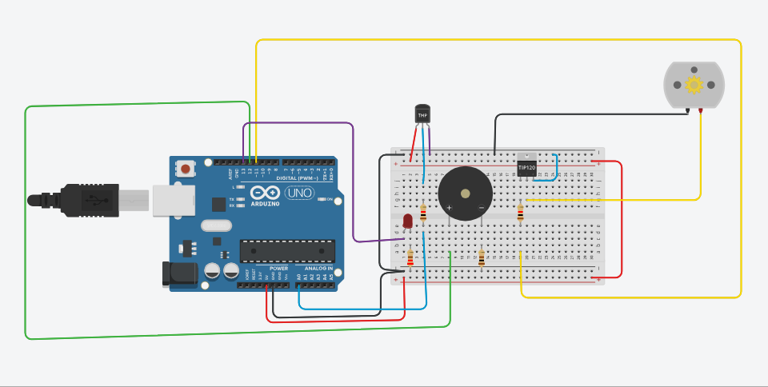

# 🌿 Projeto: Sistema de Automação de Estufa (Arduino)

Este projeto consiste em um sistema de controle de temperatura para estufas, desenvolvido com Arduino, focado no monitoramento e resposta a variações climáticas para garantir o bem-estar das plantas.



## 📋 Funcionalidades

O sistema realiza a leitura contínua de temperatura e executa ações baseadas em limites críticos:

* **Monitoramento:** Leitura em tempo real via sensor de temperatura.
* **Controle de Ventilação:** Acionamento automático de motor (ventilador) para temperaturas $\geq$ 30°C.
* **Sistema de Emergência:** Ativação de LED de alerta e aviso sonoro (buzzer) quando a temperatura ultrapassa 50°C.

## 🛠 Componentes Utilizados

* Arduino Uno (ou compatível)
* Sensor de Temperatura (TMP36 ou LM35)
* Motor DC (Ventilador)
* Buzzer (Alerta sonoro)
* LED Vermelho (Alerta visual)
* Resistores (conforme especificação dos componentes)

## 🔌 Esquema de Ligação (Pinagem)

| Componente | Pino Arduino |
| --- | --- |
| Sensor de Temperatura | A0 |
| Motor DC | D11 |
| Buzzer | D12 |
| LED Vermelho | D13 |

## 🚀 Como Executar

1. **Simulação:** O projeto foi validado no [Tinkercad](https://www.tinkercad.com/).[Desafio - Projeto Circuito Eletronico IoT](https://www.tinkercad.com/things/a9ToZcsjCwM-desafio-projeto-circuito-[...]
2. **Hardware:** Monte o circuito conforme a tabela de pinagem acima. Certifique-se de utilizar um transistor (como o TIP120) para o controle do motor se for implementar em hardware real, evitando sob[...]
3. **Código:** Copie o código disponível em src/codigo.ino para a sua IDE Arduino, compile e carregue para a placa.
4. **Assets:** Na pasta Assets, foram disponibilizados o circuito, a lista de materiais (BOM), e uma imagem do circuito.

## 💻 Código

O código principal está localizado na pasta /src. Ele utiliza a lógica de monitoramento serial para facilitar o debug e ajuste dos limites de temperatura.

```c++
// Trecho Leitura Sensor
//(a) Fazer a leitura da temperatura;
  
  // Leitura do sensor (fórmula para TMP36: voltagem -> graus Celsius)
  int leitura = analogRead(pinoSensor);
  float voltagem = leitura * (5.0 / 1023.0);
  float temperatura = (voltagem - 0.5) * 100;

  Serial.print("Temperatura: ");
  Serial.println(temperatura);

// Lógica de controle:
  
  // (b) Acionamento do motor se temperatura >= 30 °C
  if (temperatura >= 30.0) {
    digitalWrite(pinoMotor, HIGH);
  } else {
    digitalWrite(pinoMotor, LOW);
  }

  // (c) Emergência se temperatura > 50 °C
  if (temperatura > 50.0) {
    digitalWrite(pinoLed, HIGH);
    tone(pinoBuzzer, 1000); // Emite som de 1000Hz
  } else {
    digitalWrite(pinoLed, LOW);
    noTone(pinoBuzzer);     // Para o som
  }

```

## 📈 Melhorias Futuras

* **IoT:** Integração com módulos Wi-Fi (ESP8266/ESP32) para monitoramento remoto via dashboards.
* **Logging:** Envio de dados para armazenamento em banco de dados para análise de histórico.
* **Automação:** Adição de controle de umidade do solo integrado ao ecossistema de irrigação.

---

*Desenvolvido como projeto de automação acadêmica/profissional.*

---
